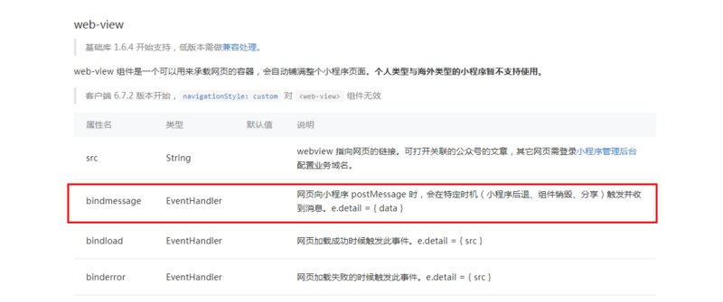

查阅[小程序官方文档](https://developers.weixin.qq.com/miniprogram/dev/component/web-view.html?search-key=wx.miniProgram.postMessage)，有这样一个接口 `wx.miniProgram.postMessage` ，可以用来从网页向小程序发送消息，然后通过 `bindmessage` 事件来监听消息，如下是官方文档描述



以下是代码：

```html
// 网页代码
<!DOCTYPE html>
<html>
    <head>
        <meta charset="utf-8">
        <meta name="viewport" content="width=device-width, initial-scale=1.0, minimum-scale=1.0, maximum-scale=1.0, user-scalable=no">
        <title>postMessage</title>
    </head>

    <body>
        <script type="text/javascript" src="https://res.wx.qq.com/open/js/jweixin-1.3.2.js"></script>
        <script type="text/javascript">
            wx.miniProgram.postMessage({ data: '获取成功' })
            
            wx.miniProgram.navigateBack({delta: 1})
        </script>
    </body>
</html>
// 小程序代码
<web-view bindmessage="handleGetMessage" src="test.html"></web-view>

Page({
  handleGetMessage: function(e) {
    console.log(e.target.data)
  }
})
```

**写完试了下，期待打印 “获取成功” ，而实际小程序里面啥也没打印。。。**

然后仔细看官方文档，发现有这句话：

> 网页向小程序 `postMessage` 时，会在**特定时机（小程序后退、组件销毁、分享）触发**并收到消息。

也就是只有在小程序后退、组件销毁、分享时才会触发

所以应该改变 `postMessage` 的时机，调换顺序就可以了


```html
<script type="text/javascript">
    wx.miniProgram.navigateBack({delta: 1})
    
    wx.miniProgram.postMessage({ data: '获取成功' })
</script>
```