flex 是个非常好用的属性，如果说有什么可以完全代替 `float` 和 `position` ，那么肯定是非它莫属了（虽然现在还有很多不支持 flex 的浏览器）。然而国内很多浏览器对 flex 的支持都不是很好，这里针对微信内置浏览器写了一套兼容写法。下面入正题。

首先还是从两个版本的语法开始讲吧，这里还是假设 flex 容器为 `.box` ，子元素为 `.item` 。

## 旧语法篇

### 定义容器的 display 属性


```
.box{
    display: -moz-box; /*Firefox*/
    display: -webkit-box; /*Safari,Opera,Chrome*/
    display: box;
}
```

### 容器属性

#### 1. box-pack 属性

box-pack 定义子元素主轴对齐方式。

```
.box{
    -moz-box-pack: center; /*Firefox*/
    -webkit-box-pack: center; /*Safari,Opera,Chrome*/
    box-pack: center;
}
```

box-pack 属性总共有 4 个值：

```
.box{
    box-pack: start | end | center | justify;
    /*主轴对齐：左对齐（默认） | 右对齐 | 居中对齐 | 左右对齐*/
}
```

#### 2. box-align 属性

box-align定义子元素交叉轴对齐方式。

```
.box{
    -moz-box-align: center; /*Firefox*/
    -webkit-box-align: center; /*Safari,Opera,Chrome*/
    box-align: center;
}
```

box-align 属性总共有 5 个值：

```
.box{
    box-align: start | end | center | baseline | stretch;
    /*交叉轴对齐：顶部对齐（默认） | 底部对齐 | 居中对齐 | 文本基线对齐 | 上下对齐并铺满*/
}
```

#### 3. box-direction 属性

box-direction 定义子元素的显示方向。

```
.box{
    -moz-box-direction: reverse; /*Firefox*/
    -webkit-box-direction: reverse; /*Safari,Opera,Chrome*/
    box-direction: reverse;
}
```

box-direction 属性总共有 3 个值：

```
.box{
    box-direction: normal | reverse | inherit;
    /*显示方向：默认方向 | 反方向 | 继承子元素的 box-direction*/
}
```

#### 4. box-orient 属性

box-orient 定义子元素是否应水平或垂直排列。

```
.box{
    -moz-box-orient: horizontal; /*Firefox*/
    -webkit-box-orient: horizontal; /*Safari,Opera,Chrome*/
    box-orient: horizontal;
}
```

box-orient 属性总共有 5 个值：

```
.box{
    box-orient: horizontal | vertical | inline-axis | block-axis | inherit;
    /*排列方向：水平 | 垂直 | 行内方式排列（默认） | 块方式排列 | 继承父级的box-orient*/
}
```

#### 5. box-lines 属性

box-lines 定义当子元素超出了容器是否允许子元素换行。

```
.box{
    -moz-box-lines: multiple; /*Firefox*/
    -webkit-box-lines: multiple; /*Safari,Opera,Chrome*/
    box-lines: multiple;
}
```

box-lines 属性总共有 2 个值：

```
.box{
    box-lines: single | multiple;
    /*允许换行：不允许（默认） | 允许*/
}
```

### 子元素属性

#### 1. box-flex 属性

box-flex 定义是否允许当前子元素伸缩。

```
.item{
    -moz-box-flex: 1.0; /*Firefox*/
    -webkit-box-flex: 1.0; /*Safari,Opera,Chrome*/
    box-flex: 1.0;
}
```

box-flex 属性使用一个浮点值：

```
.item{
    box-flex: <value>;
    /*伸缩：<一个浮点数，默认为0.0，即表示不可伸缩，大于0的值可伸缩，柔性相对>*/
}
```

#### 2.box-ordinal-group 属性

box-ordinal-group 定义子元素的显示次序，数值越小越排前。

```
.item{
    -moz-box-ordinal-group: 1; /*Firefox*/
    -webkit-box-ordinal-group: 1; /*Safari,Opera,Chrome*/
    box-ordinal-group: 1;
}
```

box-direction 属性使用一个整数值：

```
.item{
    box-ordinal-group: <integer>;
    /*显示次序：<一个整数，默认为1，数值越小越排前>*/
}
```

## 新版语法

### 定义容器的 display 属性

```
.box{
    display: -webkit-flex; /*webkit*/
    display: flex;
}

/*行内flex*/
.box{
    display: -webkit-inline-flex; /*webkit*/
    display:inline-flex;
}
```

### 容器样式

```
.box{
    flex-direction: row | row-reverse | column | column-reverse;
    /*主轴方向：左到右（默认） | 右到左 | 上到下 | 下到上*/

    flex-wrap: nowrap | wrap | wrap-reverse;
    /*换行：不换行（默认） | 换行 | 换行并第一行在下方*/

    flex-flow: <flex-direction> || <flex-wrap>;
    /*主轴方向和换行简写*/

    justify-content: flex-start | flex-end | center | space-between | space-around;
    /*主轴对齐方式：左对齐（默认） | 右对齐 | 居中对齐 | 两端对齐 | 平均分布*/

    align-items: flex-start | flex-end | center | baseline | stretch;
    /*交叉轴对齐方式：顶部对齐（默认） | 底部对齐 | 居中对齐 | 上下对齐并铺满 | 文本基线对齐*/

    align-content: flex-start | flex-end | center | space-between | space-around | stretch;
    /*多主轴对齐：顶部对齐（默认） | 底部对齐 | 居中对齐 | 上下对齐并铺满 | 上下平均分布*/
}
```

### 子元素属性

```
.item{
    order: <integer>;
    /*排序：数值越小，越排前，默认为0*/

    flex-grow: <number>; /* default 0 */
    /*放大：默认0（即如果有剩余空间也不放大，值为1则放大，2是1的双倍大小，以此类推）*/

    flex-shrink: <number>; /* default 1 */
    /*缩小：默认1（如果空间不足则会缩小，值为0不缩小）*/

    flex-basis: <length> | auto; /* default auto */
    /*固定大小：默认为0，可以设置px值，也可以设置百分比大小*/

    flex: none | [ <'flex-grow'> <'flex-shrink'>? || <'flex-basis'> ]
    /*flex-grow, flex-shrink 和 flex-basis的简写，默认值为0 1 auto，*/

    align-self: auto | flex-start | flex-end | center | baseline | stretch;
    /*单独对齐方式：自动（默认） | 顶部对齐 | 底部对齐 | 居中对齐 | 上下对齐并铺满 | 文本基线对齐*/
}
```

## 兼容写法

首先是定义容器的 `display` 属性：

```
.box{
    display: -webkit-box; /* 老版本语法: Safari, iOS, Android browser, older WebKit browsers. */
    display: -moz-box; /* 老版本语法: Firefox (buggy) */
    display: -ms-flexbox; /* 混合版本语法: IE 10 */
    display: -webkit-flex; /* 新版本语法: Chrome 21+ */
    display: flex; /* 新版本语法: Opera 12.1, Firefox 22+ */
}
```

由于旧版语法并没有列入 W3C 标准，所以这里不用写 `display:box` ，下面的语法也是一样的。

这里还要注意的是，如果子元素是行内元素，在很多情况下都要使用 `display: block` 或 `display: inline-block` 把行内子元素变成块元素（例如使用 `box-flex` 属性），这也是旧版语法和新版语法的区别之一。

### 子元素主轴对齐方式

```
.box{
    -webkit-box-pack: center;
    -moz-justify-content: center;
    -webkit-justify-content: center;
    justify-content: center;
}
```


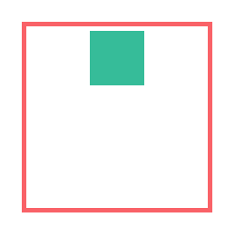

这里旧版语法有 4 个参数，而新版语法有 5 个参数，兼容写法新版语法的 `space-around` 是不可用的：

```
.box{
    box-pack: start | end | center | justify;
    /*主轴对齐：左对齐（默认） | 右对齐 | 居中对齐 | 左右对齐*/

    justify-content: flex-start | flex-end | center | space-between | space-around;
    /*主轴对齐方式：左对齐（默认） | 右对齐 | 居中对齐 | 两端对齐 | 平均分布*/
}
```

### 子元素交叉轴对齐方式

```
.box{
    -webkit-box-align: center;
    -moz-align-items: center;
    -webkit-align-items: center;
    align-items: center;
}
```


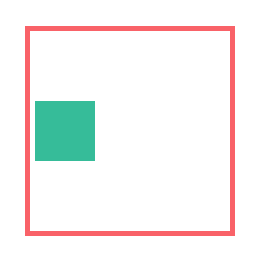

这里的参数除了写法不同，其实是功能是一样的：

```
.box{
    box-align: start | end | center | baseline | stretch;
    /*交叉轴对齐：顶部对齐（默认） | 底部对齐 | 居中对齐 | 文本基线对齐 | 上下对齐并铺满*/

    align-items: flex-start | flex-end | center | baseline | stretch;
    /*交叉轴对齐方式：顶部对齐（默认） | 底部对齐 | 居中对齐 | 上下对齐并铺满 | 文本基线对齐*/
}
```

### 子元素的显示方向

子元素的显示方向可通过 `box-direction + box-orient + flex-direction` 实现，下面请看实例：

#### 左到右

```
.box{
    -webkit-box-direction: normal;
    -webkit-box-orient: horizontal;
    -moz-flex-direction: row;
    -webkit-flex-direction: row;
    flex-direction: row;
}
```

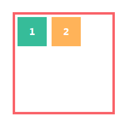

#### 右到左

```
.box{
    -webkit-box-pack: end;
    -webkit-box-direction: reverse;
    -webkit-box-orient: horizontal;
    -moz-flex-direction: row-reverse;
    -webkit-flex-direction: row-reverse;
    flex-direction: row-reverse;
}
```

这里补充说明一点： box 写法的 `box-direction` 只是改变了子元素的排序，并没有改变对齐方式，需要新增一个 `box-pack` 来改变对齐方式。


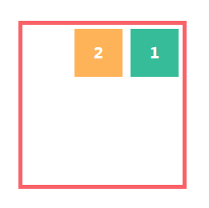

#### 上到下

```
.box{
    -webkit-box-direction: normal;
    -webkit-box-orient: vertical;
    -moz-flex-direction: column;
    -webkit-flex-direction: column;
    flex-direction: column;
}
```

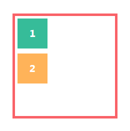


#### 下到上

```
.box{
    -webkit-box-pack: end;
    -webkit-box-direction: reverse;
    -webkit-box-orient: vertical;
    -moz-flex-direction: column-reverse;
    -webkit-flex-direction: column-reverse;
    flex-direction: column-reverse;
}
```

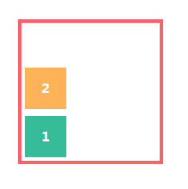

### 是否允许子元素伸缩

```
.item{
    -webkit-box-flex: 1.0;
    -moz-flex-grow: 1;
    -webkit-flex-grow: 1;
    flex-grow: 1;
}
```

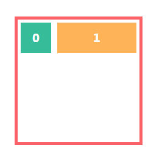

```
.item{
    -webkit-box-flex: 1.0;
    -moz-flex-shrink: 1;
    -webkit-flex-shrink: 1;
    flex-shrink: 1;
}
```

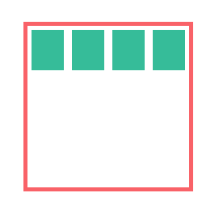

上面是允许放大，box语法中 `box-flex` 如果不是 0 就表示该子元素允许伸缩，而 flex 是分开的，上面 `flex-grow` 是允许放大（默认不允许），下面的 `flex-shrink` 是允许缩小（默认允许）。`box-flex` 默认值为 0 ，也就是说，在默认的情况下，在两个浏览器中的表现是不一样的：

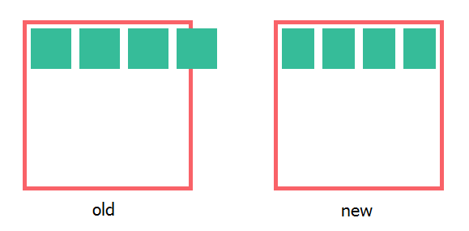

这里还有一点，就是新旧语法的算法是不一样的，假设 `box-flex` 的值不等于 0 ，旧语法中，如果有多余的空间，`box-flex` 的值越大，说明空白部分的占比越多，反之亦然：

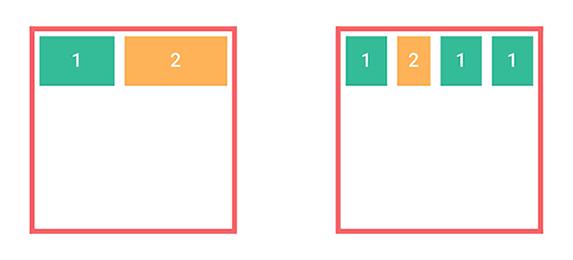

而新版的语法中，放大的比例是直接按 `flex-grow` 的值来分配的，`flex-grow` 的缩放会覆盖 `flex-shrink: 0`，看例子：

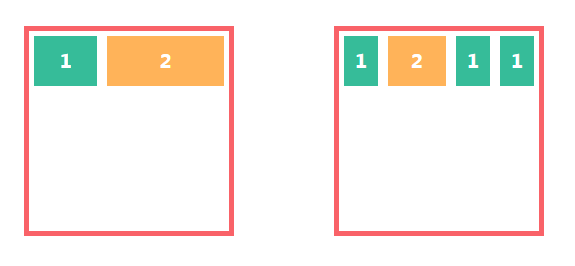

参数：

```
.item{
    box-flex: <value>;
    /*伸缩：<一个浮点数，默认为0.0，即表示不可伸缩，大于0的值可伸缩，柔性相对>*/

    flex-grow: <number>; /* default 0 */
    /*放大：默认0（即如果有剩余空间也不放大，值为1则放大，2是1的双倍大小，以此类推）*/

    flex-shrink: <number>; /* default 1 */
    /*缩小：默认1（如果空间不足则会缩小，值为0不缩小）*/
}
```

### 子元素的显示次序

```
.item{
    -webkit-box-ordinal-group: 1;
    -moz-order: 1;
    -webkit-order: 1;
    order: 1;
}
```

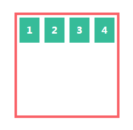
